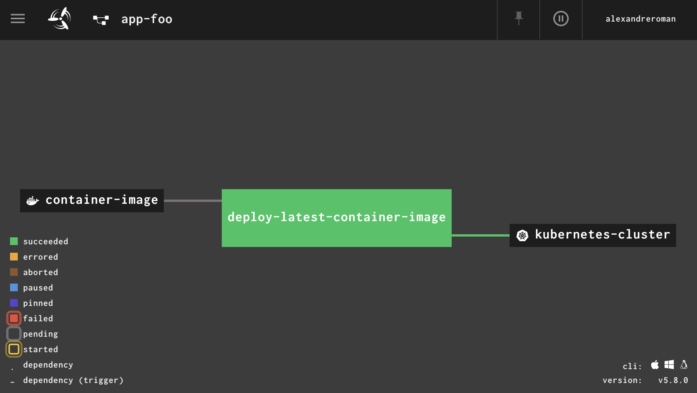
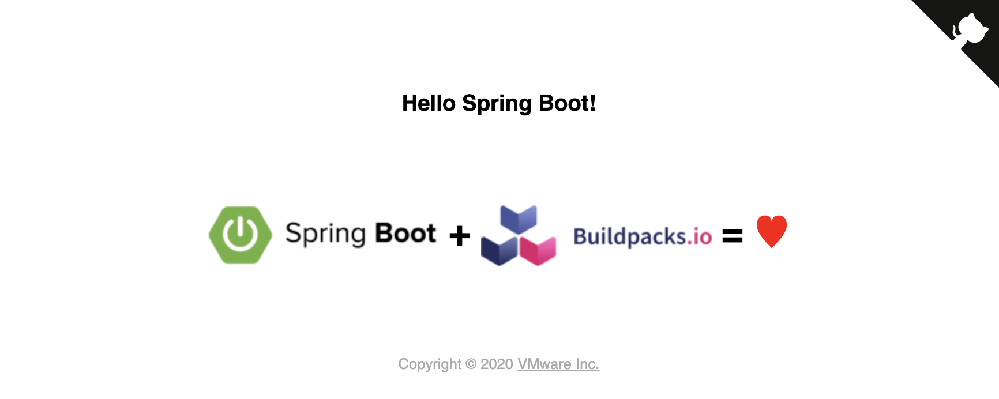
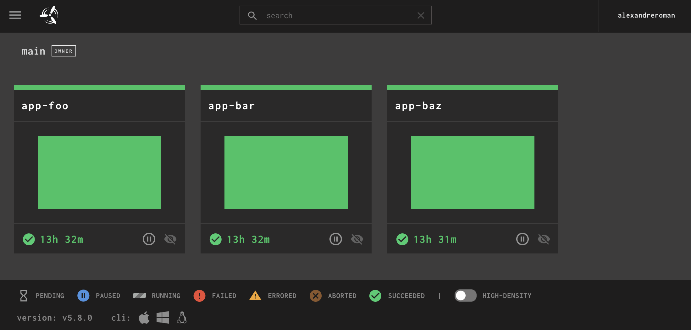
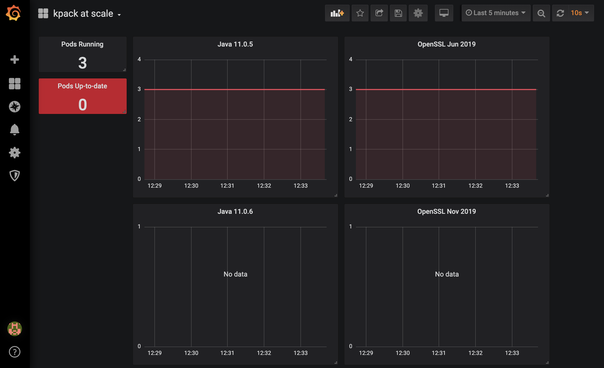
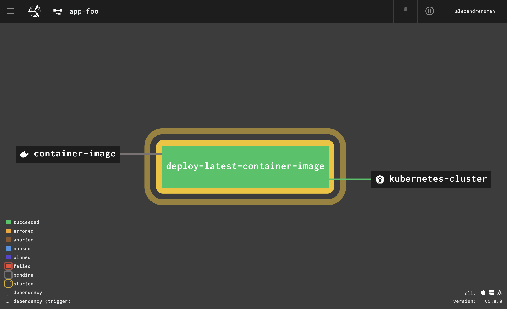
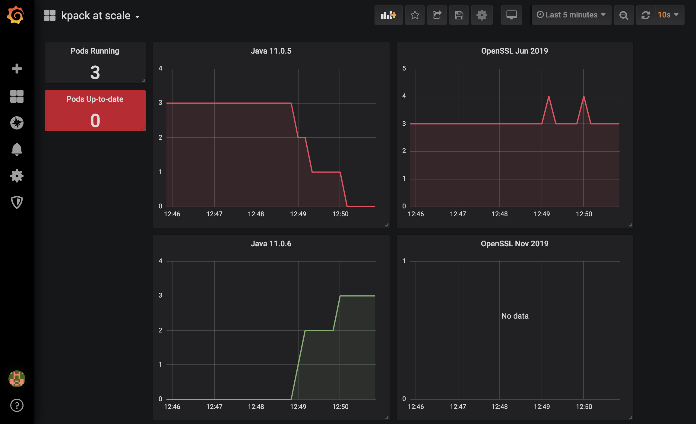
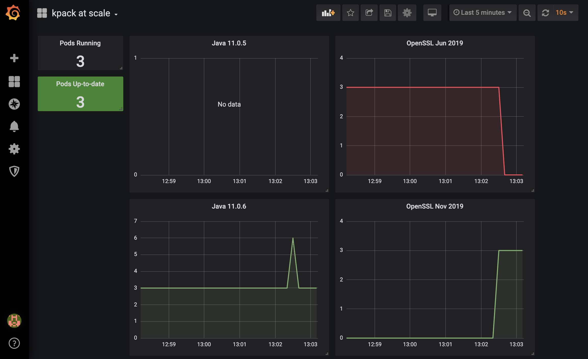

# Building container images at scale using kpack

This project shows how to leverage [kpack](https://github.com/pivotal/kpack),
an open-source project from [Pivotal](https://pivotal.io), to build container
images in Kubernetes at scale.

Using kpack, you don't need to write a `Dockerfile` anymore for your app:
[Cloud-Native Buildpacks](https://buildpacks.io) will take care of building your app
from source code, adding runtime environments (such as a JVM or a NodeJS engine),
as well as configuring your app to run well in a containerized environment
([ever heard of `oom` when using Java in a container?](https://success.docker.com/article/java-app-is-killed-by-docker)).

kpack runs in a Kubernetes environment: you interact with kpack using YAML files,
which will create Kubernetes native objects. When configuring kpack for your app,
you basically only need to define where to get your app (binary form or source code),
container registry credentials (to store the resulting image) and the container image
destination.
[Please see this GitHub repo to learn how to use kpack](https://github.com/alexandreroman/kpack101).

In this project, we'll use a kpack installation with
[3 Spring Boot apps](https://github.com/alexandreroman/cnb-springboot)
deployed to a Kubernetes cluster.
[A simple Concourse pipeline](https://github.com/alexandreroman/concourse-k8s-deploy-pipeline)
is used to automatically deploy the latest container images to Kubernetes:
you may use any CI/CD tools as a replacement (such as Jenkins, GitLab, Spinnaker, etc.).



For the purpose of the demonstration, these container images are built with
old JVM versions and an old stack (containing middleware libraries
such as OpenSSL or glibc). In a real-world project, container images are expected
to use the latest buildpacks and stacks: when an update is available, kpack
would automatically update container images.

We'll simulate these buildpack / stack updates by using a custom kpack Java builder.

## How to use it?

### Deploying kpack

Make sure
[kpack is deployed to your Kubernetes cluster](https://github.com/pivotal/kpack/blob/master/docs/install.md).

You should have no issues deploying kpack to your favorite Kubernetes cluster.

kpack resources are running in the `kpack` namespace:
```bash
$ kubectl -n kpack get pods
NAME                                READY   STATUS    RESTARTS   AGE
kpack-controller-5f66c774d8-sl9md   1/1     Running   0          7d17h
kpack-webhook-847c887dd-xgtp5       1/1     Running   0          7d17h
```

You may access kpack logs to see how the controller reacts to events
(buildpack update, source code change, etc.):
```bash
$ kubectl -n kpack logs -l app=kpack-controller -f
2020-02-04T10:42:20.384Z        INFO    controller/controller.go:351    Reconcile succeeded. Time taken: 1.816832832s.  {"knative.dev/traceid": "212e8703-d437-4cf0-967e-0b1e1148caef", "knative.dev/key": "default"}
2020-02-04T10:42:32.179Z        DEBUG   controller/controller.go:313    Processing from queue kpack-builders/app-bar-source (depth: 0)
2020-02-04T10:42:32.723Z        DEBUG   controller/controller.go:267    Adding to queue kpack-builders/app-bar-source (delay: 1m0s, depth: 0)
2020-02-04T10:42:32.723Z        INFO    controller/controller.go:351    Reconcile succeeded. Time taken: 543.884902ms.  {"knative.dev/traceid": "d34aedc3-56b0-4399-8cf7-457fbec8b9d1", "knative.dev/key": "kpack-builders/app-bar-source"}
2020-02-04T10:42:36.597Z        DEBUG   controller/controller.go:313    Processing from queue kpack-builders/app-foo-source (depth: 0)
2020-02-04T10:42:36.949Z        DEBUG   controller/controller.go:313    Processing from queue kpack-builders/app-baz-source (depth: 0)
2020-02-04T10:42:36.969Z        DEBUG   controller/controller.go:267    Adding to queue kpack-builders/app-foo-source (delay: 1m0s, depth: 0)
2020-02-04T10:42:36.969Z        INFO    controller/controller.go:351    Reconcile succeeded. Time taken: 372.030594ms.  {"knative.dev/traceid": "46e19fe7-d200-4093-9538-7d90fabea828", "knative.dev/key": "kpack-builders/app-foo-source"}
2020-02-04T10:42:37.296Z        DEBUG   controller/controller.go:267    Adding to queue kpack-builders/app-baz-source (delay: 1m0s, depth: 0)
2020-02-04T10:42:37.296Z        INFO    controller/controller.go:351    Reconcile succeeded. Time taken: 347.11171ms.   {"knative.dev/traceid": "3b7a349e-2eed-4904-8f09-825800be4f90", "knative.dev/key": "kpack-builders/app-baz-source"}
```

### Configuring kpack

kpack is up and running: let's configure it.

Create new file `kpack/credentials/dockerhub-creds.yml` from template
`kpack/credentials/dockerhub-creds.template.yml`, and set up your Docker Hub
credentials (you may also use your own container registry):
```yaml
apiVersion: v1
kind: Secret
metadata:
  name: dockerhub-creds
  namespace: kpack-builders
  annotations:
    build.pivotal.io/docker: https://index.docker.io/v1/
type: kubernetes.io/basic-auth
stringData:
  username: johndoe
  password: changeme
```

Same story for GitHub access: kpack will monitor your Git repository, so that
new container images are built when you update your source code.

Create new file `kpack/credentials/github-creds.yml` from template
`kpack/credentials/github-creds.template.yml` (feel free to use any Git repository):
```yaml
apiVersion: v1
kind: Secret
metadata:
  name: github-creds
  namespace: kpack-builders
  annotations:
    build.pivotal.io/git: https://github.com
type: kubernetes.io/basic-auth
stringData:
  username: johndoe
  password: changeme
```

Please note you may need to use a
[GitHub access token](https://help.github.com/en/github/authenticating-to-github/creating-a-personal-access-token-for-the-command-line)
if Two-Factor Authentication is enabled for your GitHub account.

Then you need to edit container image definitions, targeting your container registry
(see files `kpack/images/app-XXX-image.yml`) with the tag property:
```yaml
apiVersion: build.pivotal.io/v1alpha1
kind: Image
metadata:
  name: app-foo
  namespace: kpack-builders
spec:
  tag: alexandreroman/cnb-springboot-foo
  serviceAccount: kpack-service-account
  builder:
    name: custom-java-builder
    kind: CustomBuilder
  cacheSize: "2Gi"
  source:
    git:
      url: https://github.com/alexandreroman/cnb-springboot.git
      revision: testing
```

You're done!

Please note a custom Java builder is defined in `kpack/custom-java-builder.yml`.
This Java builder is already configured to use old buildpacks / stacks:
later in this page we'll update this builder in place to reference newer
buildpacks / stacks.

Deploy this configuration to your Kubernetes cluster:
```bash
$ kubectl apply -f kpack/credentials
$ kubectl apply -f kpack/custom-java-builder.yml
$ kubectl apply -f kpack/images
```

Check kpack configuration (the builder state is expected to be `BuilderReady`):
```bash
$ kubectl -n kpack-builders describe image app-foo
Name:         app-foo
Namespace:    kpack-builders
Labels:       <none>
Annotations:  kubectl.kubernetes.io/last-applied-configuration:
                {"apiVersion":"build.pivotal.io/v1alpha1","kind":"Image","metadata":{"annotations":{},"name":"app-foo","namespace":"kpack-builders"},"spec...
API Version:  build.pivotal.io/v1alpha1
Kind:         Image
Metadata:
  Creation Timestamp:  2020-02-04T08:07:36Z
  Generation:          1
  Resource Version:    19276900
  Self Link:           /apis/build.pivotal.io/v1alpha1/namespaces/kpack-builders/images/app-foo
  UID:                 677aacb8-4725-11ea-a1b5-42010a000c0a
Spec:
  Builder:
    Kind:                      CustomBuilder
    Name:                      custom-java-builder
  Cache Size:                  2Gi
  Failed Build History Limit:  10
  Image Tagging Strategy:      BuildNumber
  Service Account:             kpack-service-account
  Source:
    Git:
      Revision:                 testing
      URL:                      https://github.com/alexandreroman/cnb-springboot.git
  Success Build History Limit:  10
  Tag:                          alexandreroman/cnb-springboot-foo
Status:
  Build Cache Name:  app-foo-cache
  Build Counter:     4
  Conditions:
    Last Transition Time:  2020-02-04T09:13:28Z
    Status:                True
    Type:                  Ready
    Last Transition Time:  <nil>
    Status:                True
    Type:                  BuilderReady
  Latest Build Ref:        app-foo-build-4-j7b92
  Latest Image:            index.docker.io/alexandreroman/cnb-springboot-foo@sha256:14d03b8dbce97cd94a83e66f7875f04a75f6a3c9cad6ec0187ad51bdbb372457
  Latest Stack:            org.cloudfoundry.stacks.cflinuxfs3
  Observed Generation:     1
Events:                    <none>
```

### Deploying sample apps

Edit Kubernetes descriptors in directory `k8s` to use your container registry:
```yaml
spec:
  containers:
    - image: alexandreroman/cnb-springboot-foo
      name: app
```

Deploy the 3 sample apps:
```bash
$ kubectl apply -f k8s
```

Make sure these apps are running
(in 3 namespaces: `app-foo`, `app-bar`, `app-baz`):
```bash
$ kubectl get pod,svc --all-namespaces -l app=cnb-springboot
NAMESPACE   NAME                       READY   STATUS    RESTARTS   AGE
app-bar     pod/app-797997fb6b-zm8r5   1/1     Running   0          4m1s
app-baz     pod/app-76b89bc94b-dbxhm   1/1     Running   0          4m1s
app-foo     pod/app-5959488d8f-zt6rv   1/1     Running   0          4m1s

NAMESPACE   NAME          TYPE           CLUSTER-IP       EXTERNAL-IP      PORT(S)        AGE
app-bar     service/app   LoadBalancer   10.100.200.97    34.77.235.10     80:31084/TCP   18h
app-baz     service/app   LoadBalancer   10.100.200.106   34.77.72.214     80:32176/TCP   18h
app-foo     service/app   LoadBalancer   10.100.200.119   35.195.215.162   80:31606/TCP   18h
```



### Deploying Concourse pipelines

Let's create deployment pipelines: we want to automatically deploy the latest
container image to our Kubernetes cluster. We expect kpack to build new container images
as we'll simulate buildpack / stack updates.

Deployment pipelines are implemented with
[Concourse](https://concourse-ci.org).
A simple `kubectl` command is executed to update Kubernetes deployments
with new container image tags. Each pipeline is started when a new container image
appears in the container registry.

You first need to set configuration properties according to your environment.

Create new file `ci/k8s.yml` starting from template `ci/k8s.template.yml`:
```yaml
kubernetes-config: |
  >--- PASTE YOUR .kube/config HERE ---<

# Select a context from the Kubernetes config. Leave empty to use default context.
kubernetes-context:

# Match this attribute with your cluster version.
kubernetes-version: 1.15

# Set to true to disable TLS verification when using kubectl commands.
kubernetes-skip-tls-verification: false

# Set how long to wait for pods to run (seconds), 0 means "don't wait".
kubernetes-wait-until-ready: 180
```

You should only need to paste your `.kube/config` file in the configuration properties.

Make sure you also update the pipeline configuration for each app (`ci/app-XXX.yml`)
to use your container registry:
```yaml
container-image: alexandreroman/cnb-springboot-foo
```

When you're done, deploy 3 pipelines (one for each app) to your Concourse instance:
```bash
$ fly -t concourse set-pipeline -p app-foo -c ci/pipeline.yml -l ci/k8s.yml -l ci/app-foo.yml
$ fly -t concourse set-pipeline -p app-bar -c ci/pipeline.yml -l ci/k8s.yml -l ci/app-bar.yml
$ fly -t concourse set-pipeline -p app-baz -c ci/pipeline.yml -l ci/k8s.yml -l ci/app-baz.yml
```

Don't forget to unpause all pipelines.

At this point, every time a new container image is deployed to your container registry,
a pipeline will start to update the Kubernetes deployment with zero downtime.



### Monitoring application state

Each app instance (pod) exposes metrics, leveraging Spring Boot Actuator and Micrometer.
Metrics are available at `/actuator/metrics`, but you may also use `/actuator/prometheus`
with Prometheus to scrape metrics.

A custom metric is available in the app under `app_info`: this counter includes the
Java version and the OpenSSL library version used in a container image.
See `MetricsConfig.java` for implementation details.

You may manually access this metric to see these values:
```bash
$ http 35.195.215.162/actuator/metrics/app.info 
HTTP/1.1 200 
Connection: keep-alive
Content-Disposition: inline;filename=f.txt
Content-Type: application/vnd.spring-boot.actuator.v3+json
Date: Tue, 04 Feb 2020 11:27:30 GMT
Keep-Alive: timeout=60
Transfer-Encoding: chunked

{
    "availableTags": [
        {
            "tag": "java.version",
            "values": [
                "11.0.5"
            ]
        },
        {
            "tag": "openssl.version",
            "values": [
                "OpenSSL 1.1.1  11 Sep 2018 built on: Thu Jun 20 17:36:28 2019 UTC"
            ]
        }
    ],
    "baseUnit": null,
    "description": "Get application info",
    "measurements": [
        {
            "statistic": "COUNT",
            "value": 1.0
        }
    ],
    "name": "app.info"
}
```

You'd better use a visual dashboard, such as Grafana, to monitor application state.
How lucky you are: this project includes such a dashboard!

You may not have Prometheus / Grafana available in your Kubernetes cluster:
[use this GitHub repository to deploy these components](https://github.com/alexandreroman/k8s-toolbox).

Once you're ready, create a new dashboard using file `grafana/kpack-dashboard.json`:



Next step: monitor application state while we'll simulate buildpack / stack updates.

### Updating JVM for all container images

Let's assume a new JVM is out: this version includes many bugfixes, which may resolve
security issues. You want all apps running in production to use this JVM version, right?
How could you update all your container images with this JVM, at scale?

Search no more: we'll let kpack handle this update for us.

Apps currently use Java `11.0.5`: we want these apps to use Java `11.0.6`.

Update the kpack Java builder with new buildpacks:
```bash
$ kubectl apply -f kpack/jvm-update
```

If you observe kpack build logs, a new build should start soon
(using `logs` CLI from kpack):
```bash
$ logs -namespace kpack-builders -image app-foo
[prepare] prepare:fetch.go:66: Successfully cloned "https://github.com/alexandreroman/cnb-springboot.git" @ "8532c6d23ff8a89f1de4854cbe0615de3cc0c415" in path "/workspace"
[detect] org.cloudfoundry.openjdk        v1.2.0
[detect] org.cloudfoundry.buildsystem    v1.2.0
[detect] org.cloudfoundry.jvmapplication v1.1.0
[detect] org.cloudfoundry.springboot     v1.2.0
[analyze] Restoring metadata for "org.cloudfoundry.openjdk:openjdk-jre" from app image
[analyze] Restoring metadata for "org.cloudfoundry.openjdk:2f08c469c9a8adea1b6ee3444ba2a8242a7e99d87976a077faf037a9eb7f884b" from cache
[analyze] Restoring metadata for "org.cloudfoundry.openjdk:6dd0c9c8a740e6c19149e98034fba8e368fd9aa16ab417aa636854d40db1a161" from cache
[analyze] Restoring metadata for "org.cloudfoundry.openjdk:openjdk-jdk" from cache
[analyze] Restoring metadata for "org.cloudfoundry.buildsystem:build-system-cache" from cache
[analyze] Restoring metadata for "org.cloudfoundry.jvmapplication:executable-jar" from app image
[analyze] Restoring metadata for "org.cloudfoundry.springboot:spring-boot" from app image
[restore] Restoring data for "org.cloudfoundry.openjdk:2f08c469c9a8adea1b6ee3444ba2a8242a7e99d87976a077faf037a9eb7f884b" from cache
[restore] Restoring data for "org.cloudfoundry.openjdk:6dd0c9c8a740e6c19149e98034fba8e368fd9aa16ab417aa636854d40db1a161" from cache
[restore] Restoring data for "org.cloudfoundry.openjdk:openjdk-jdk" from cache
[restore] Restoring data for "org.cloudfoundry.buildsystem:build-system-cache" from cache
[restore] Restoring data for "org.cloudfoundry.jvmapplication:executable-jar" from cache
[restore] Restoring data for "org.cloudfoundry.springboot:spring-boot" from cache
[build]
[build] Cloud Foundry OpenJDK Buildpack v1.2.0
[build]   OpenJDK JDK 11.0.6: Contributing to layer
[build]     Downloading from https://github.com/AdoptOpenJDK/openjdk11-binaries/releases/download/jdk-11.0.6%2B10/OpenJDK11U-jdk_x64_linux_hotspot_11.0.6_10.tar.gz
[build]     Verifying checksum
[build]     Expanding to /layers/org.cloudfoundry.openjdk/openjdk-jdk
[build]     Writing JAVA_HOME to build
[build]     Writing JDK_HOME to build
[build]   OpenJDK JRE 11.0.6: Contributing to layer
[build]     Downloading from https://github.com/AdoptOpenJDK/openjdk11-binaries/releases/download/jdk-11.0.6%2B10/OpenJDK11U-jre_x64_linux_hotspot_11.0.6_10.tar.gz
[build]     Verifying checksum
[build]     Expanding to /layers/org.cloudfoundry.openjdk/openjdk-jre
[build]     Writing JAVA_HOME to shared
[build]     Writing MALLOC_ARENA_MAX to shared
[build]     Writing .profile.d/active-processor-count
...
[export] Reusing layer 'launcher'
[export] Adding layer 'org.cloudfoundry.openjdk:class-counter'
[export] Adding layer 'org.cloudfoundry.openjdk:java-security-properties'
[export] Adding layer 'org.cloudfoundry.openjdk:jvmkill'
[export] Adding layer 'org.cloudfoundry.openjdk:link-local-dns'
[export] Adding layer 'org.cloudfoundry.openjdk:memory-calculator'
[export] Adding layer 'org.cloudfoundry.openjdk:openjdk-jre'
[export] Adding layer 'org.cloudfoundry.openjdk:security-provider-configurer'
[export] Reusing layer 'org.cloudfoundry.jvmapplication:executable-jar'
[export] Reusing layer 'org.cloudfoundry.springboot:spring-boot'
[export] Adding 6/6 app layer(s)
[export] Adding layer 'config'
[export] *** Images (sha256:93936ad676a59795cd4ea28d050b98bed9bd4239d968d4cf847c3044c333d8ed):
[export]       alexandreroman/cnb-springboot-foo
[export]       index.docker.io/alexandreroman/cnb-springboot-foo:b5.20200204.114613
[export] Adding cache layer 'org.cloudfoundry.openjdk:openjdk-jdk'
[export] Adding cache layer 'org.cloudfoundry.buildsystem:build-system-application'
[export] Reusing cache layer 'org.cloudfoundry.buildsystem:build-system-cache'
[export] Reusing cache layer 'org.cloudfoundry.jvmapplication:executable-jar'
[export] Reusing cache layer 'org.cloudfoundry.springboot:spring-boot'
[completion] Build successful
```

New container images are built by kpack: you don't need to edit a `Dockerfile`
to use a new JVM. You don't even need to update your source code!

Look at the deployment pipeline:



As Kubernetes deployments are getting updated with new container images,
new pods are deployed with the new JVM:



[Remember Heartbleed, the OpenSSL vulnerability issue?](https://en.wikipedia.org/wiki/Heartbleed)

Suddenly, all container images using OpenSSL (that's a lot of container images!) had
to be patched with a new version of this library. Depending on the number of container
images you run, patching everything could take a lot of time.

Thankfully we now have kpack!
Let's see how to patch our apps with a newer OpenSSL library version.

Update the Java builder with a new stack
(which contains middleware librairies such as OpenSSL and glibc):
```bash
$ kubectl apply -f kpack/stack-update
```

kpack soon discovers there's a new stack available, and a new build starts
for each container image:
```bash
$ logs -namespace kpack-builders -image app-foo
[rebase] *** Images (sha256:14041569872bff7a85c1ed39cf6d41e0c5a5c1b8c6665b90cf89980c9ece3ddb):
[rebase]       alexandreroman/cnb-springboot-foo
[rebase]       index.docker.io/alexandreroman/cnb-springboot-foo:b6.20200204.120052
[rebase]
[rebase] *** Digest: sha256:14041569872bff7a85c1ed39cf6d41e0c5a5c1b8c6665b90cf89980c9ece3ddb
[completion] Build successful
```

Please note that patching container images with a new stack is actually very fast.
kpack leverages Cloud-Native Buildpacks to build container images. Container images
built with this technology are optimized with dedicated layers for key components.
Patching a stack only requires an update to a single layer. Moreover, since all
layers are available in container registries, there is no need to build a new
container image: existing container images are remotely "patched", by replacing
the old stack layer by the newer one. This is why you only see a rebase operation
here.

In the end, all deployment pipelines will start since new container images are
available:


All running pods are now using fully patched container images:



**Building and securing container images at scale is so easy with kpack!**

## Contribute

Contributions are always welcome!

Feel free to open issues & send PR.

## License

Copyright &copy; 2020 [VMware, Inc. or its affiliates](https://vmware.com).

This project is licensed under the [Apache Software License version 2.0](https://www.apache.org/licenses/LICENSE-2.0).
